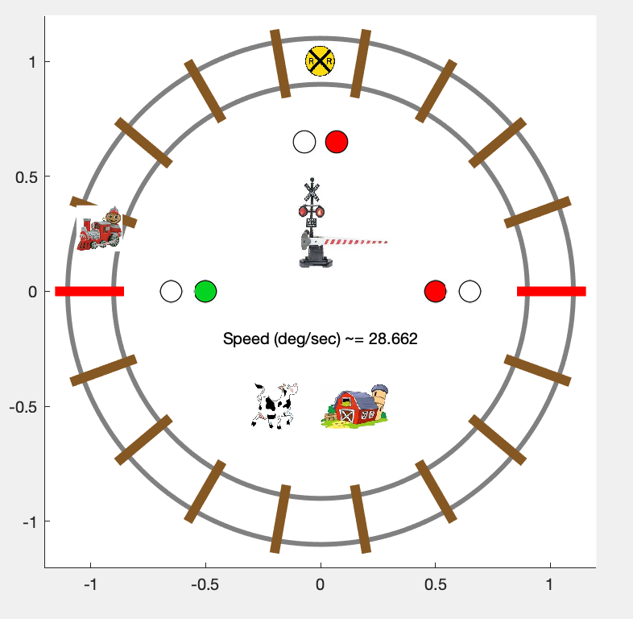

# Train-Simulator
A control system for a miniature train set to run in a train simulator using MATLAB.

## How to Run "Train Simulator"?
1.) Open up the "Team_Advance_Train_Simulator_Mark_2.m" with MATLAB 2017b or newer.

2.) Run the "Team_Advance_Train_Simulator_Mark_2.m" code to start the simulator.

3.) Type "1" or "2" to select urban or rural, respectively.

4.) Train Simulation will run according to the selection.

## Train Simulation Screenshots:

